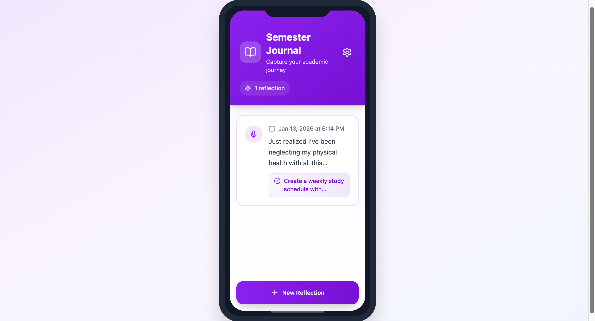

# Reflect App

Reflect App is a personal journaling and reflection tool that helps users track their well-being, organize tasks, and review progress.

## Features

- Daily reflection
- Tags and calendar view
- Mood and pattern tracking
- Secure and private

## Usage

Open the app in a browser and start reflecting on your projects and well-being.

## Technologies

- HTML
- CSS
- JavaScript
- React
- AI

## Preview

